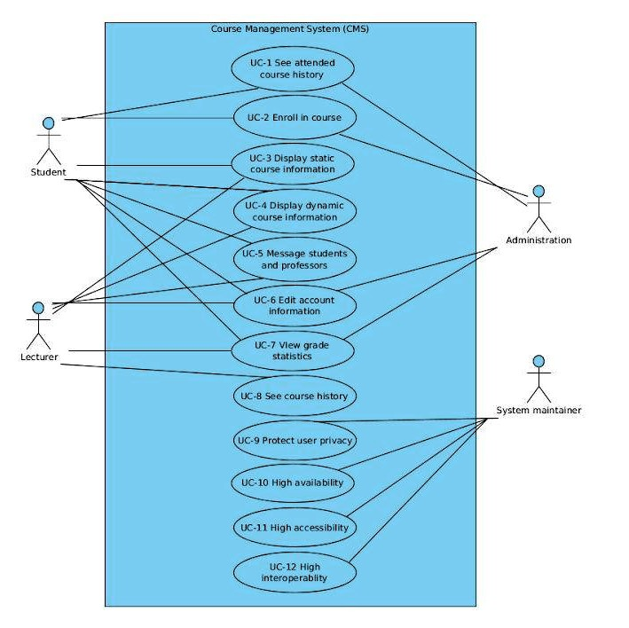

# Design Objective 
General Requirements| Functional Requirements| Non-Functional Requirements
-|-
* Please check the attached document Requirements_Document_for_CMS.pdf for detailed list of functional, non-functional and general requirements
# Use Cases

|
---
# Quality Attributes
ID | Quality Attribute| Associated Use Case|
-|-|-
QA-1| Performance | UC-10|
QA-2| Modifiability | UC-2, UC-6|
QA-3| Availability | UC-10, UC-11|
QA-4| Performance | UC-11, UC-12|
QA-5| Performance | UC-5, UC-10, UC-11, UC-12|
QA-6| Security | All
# Scenarios

# Constrain Requirements
ID| Constraint|
-|-
CON-1| A minimum of 100 simultaneous users must be supported|
CON-2| The system must be accessed through a web browser (Chrome, firefox, IE) in different platforms (Windows, OSX, and Linux).|
CON-3| A relational database server must be user to store course related information as well as data about the students and the lecturers.|
CON-4| Student records should be stored indefinitely.|

# Concerns 

