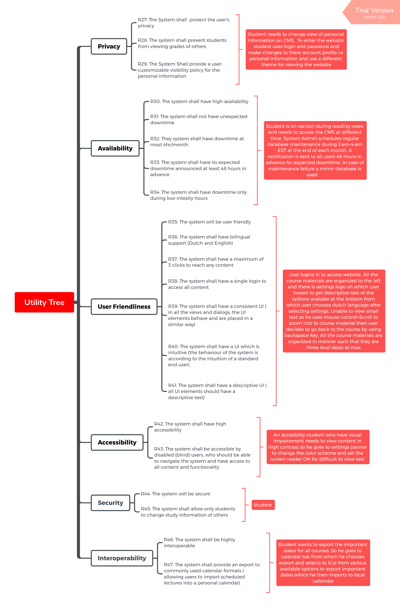

# Design Objective 
General Requirements| Functional Requirements| Non-Functional Requirements
-|-|-
* Please check the attached document [Requirements_Document_for_CMS.pdf](../projectFiles/Requirements_Document_for_CMS.pdf) for detailed list of functional, non-functional and general requirements
# Use Cases

|
---
# Quality Attributes
ID | Quality Attribute| Associated Use Case|
-|-|-
QA-1| Performance      | UC-10, UC-1, UC-4, UC-3|  
QA-2| Modifiability    | UC-6, UC-10     |
QA-3| Availability     | UC-10     |
QA-4| Performance      | UC-5, UC-11   |
QA-5| Security         | UC 9, UC-10      |
QA-6| Extensibility    | UC 6, UC-7, UC-2 |
QA-7| Interoperability | UC-12
QA-8| Functionality    | All
QA-9|Scalability       |  
QA-10|Flexibility      | UC-6 
QA-11|Reliability      | 
QA-12|Privacy          | UC 9
# Scenarios

Quality Attribute|

# Constrain Requirements
ID| Constraint|
-|-
CONS-1| System must have high availability and no more than 4hours of downtime |
CONS-2| System must be extensible/Scalable allowing students, lecturers and admin to add, remove or modify information according to their privilege |
CONS-3| System must be secure and private and allow viewing and based on user privileges |
CONS-4| Student records should be stored indefinitely.|
CONS-5| Users can securely interact with minimum performance degradation|
CONS-6| System must be able to handle multiple user request|
CONS-7| System must be able to update and notify |
CON-8| System must be able to handle message-based communication |
CON-9| System must support multiple user types i.e Students, Lecturers, Administrator.| 

minimum, maximum, must 
# Concerns 
## General Concerns
* System Structure(i.e Technologies and existing frameworks)
* Deployment Pattern
* Updating the Database
## Specific Concerns
* Exceptional Handling 
* Authentication
* Authorization and Administration privileges
* Session Management
* State Management for messaging 
* Messaging Data-Formats
## Internal Requirements
* Team collaboration
* Uploading large data files
* Minimum number of client request/access to information  

## Issues
* Risk involving modification or expansion of database storage 
* Dealing with multiple users request simultaneously 
* Database failure 

