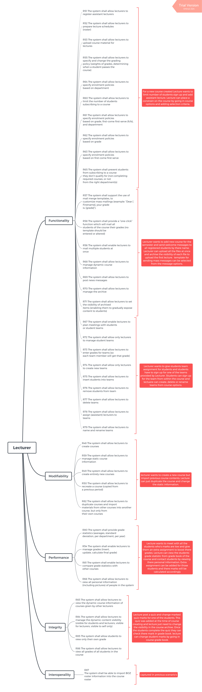

# Design Objective 
General Requirements| Functional Requirements| Non-Functional Requirements
-|-|-
* Please check the attached document [Requirements_Document_for_CMS.pdf](../projectFiles/Requirements_Document_for_CMS.pdf) for detailed list of functional, non-functional and general requirements
# Use Cases

|
---
# Quality Attributes
ID | Quality Attribute| Associated Use Case|
-|-|-
QA-1 |Performance      | 2,5,15,23 |
QA-2 |Modifiability    | 1,8,11,14,22     |
QA-3 |Availability     |17   |
QA-4 |User Friendliness|2,3,5|
QA-5 |Security         |7,9      |
QA-6 |Extensibility    | 17,18 |
QA-7 |Interoperability | 20,11 |
QA-8 |Functionality    | 3,6,9,10,12,13,20,21 |
QA-9 |Scalability      | 10,17,18  
QA-10|Flexibility      | 1,7,19,4 | 
QA-11|Reliability      | 9,2|
QA-12|Privacy          | 1,9|
QA-13|Integrity        | 7,16|
QA-14|Maintainability  |17|
QA-15|Accessibility     |8 |

# Scenarios

# Constrain Requirements
ID| Constraint|
-|-
CON-1| System must have high availability and no more than 4hours of downtime |
CON-2| System must be extensible/Scalable allowing students, lecturers and admin to add, remove or modify information according to their privilege |
CON-3| System must be secure and private and allow viewing and based on user privileges |
CON-4| Student records should be stored indefinitely.|
CON-5| Users can securely interact with minimum performance degradation|
CON-6| System must be able to handle multiple user request|
CON-7| System must be able to update and notify |
CON-8| System must be able to handle message-based communication |
CON-9| System must support multiple user types i.e Students, Lecturers, Administrator.| 

# Concerns 

ID| Concern|
-|-
CRN- 1|Exceptional Handling 
CRN- 2| Authentication
CRN- 3| Authorization and Administration privileges
CRN- 4| Session Management
CRN- 5| System Structure(i.e Technologies and existing frameworks)
CRN- 6| Deployment Pattern
CRN- 7| Team collaboration
CRN- 8| Minimum number of client request/access to information  
CRN- 9| Risk involving modification or expansion of database storage 
CRN- 10| Dealing with multiple users request simultaneously 
CRN- 11| Database failure 

