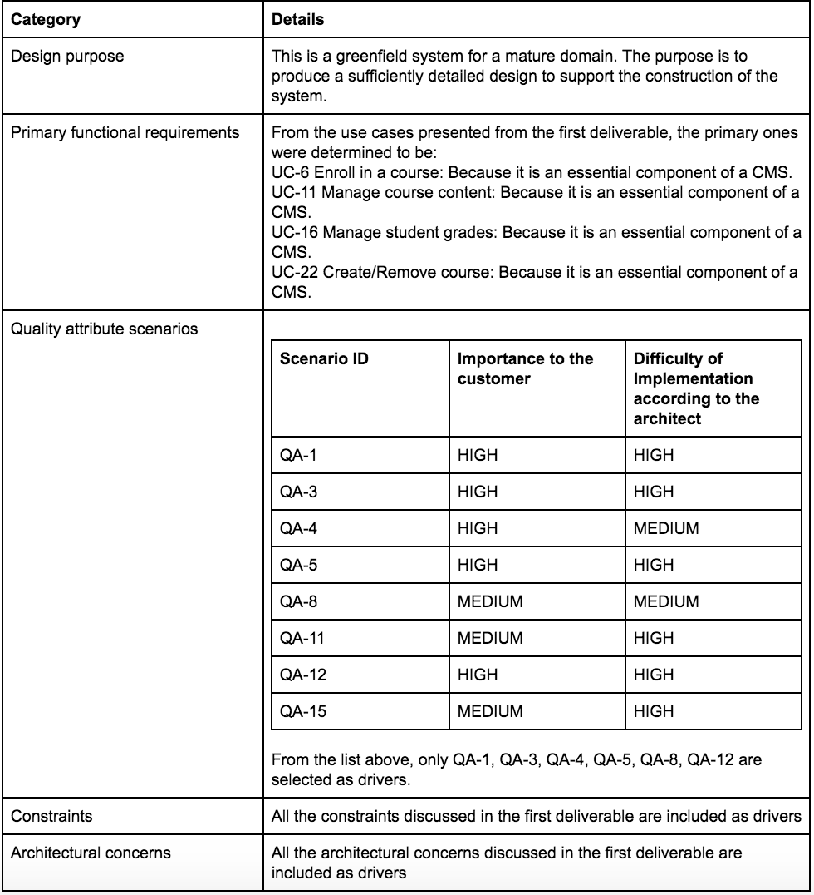
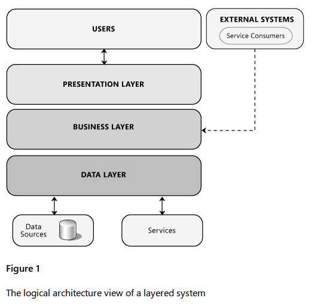
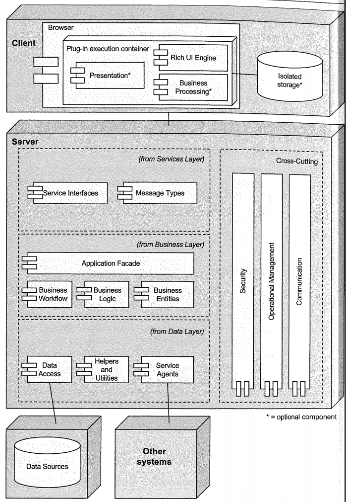
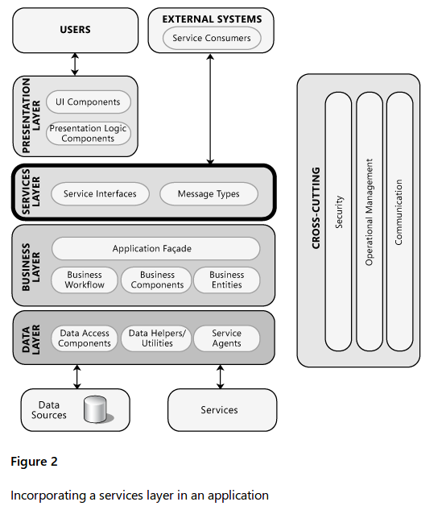
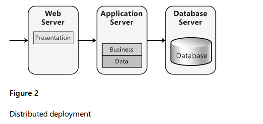
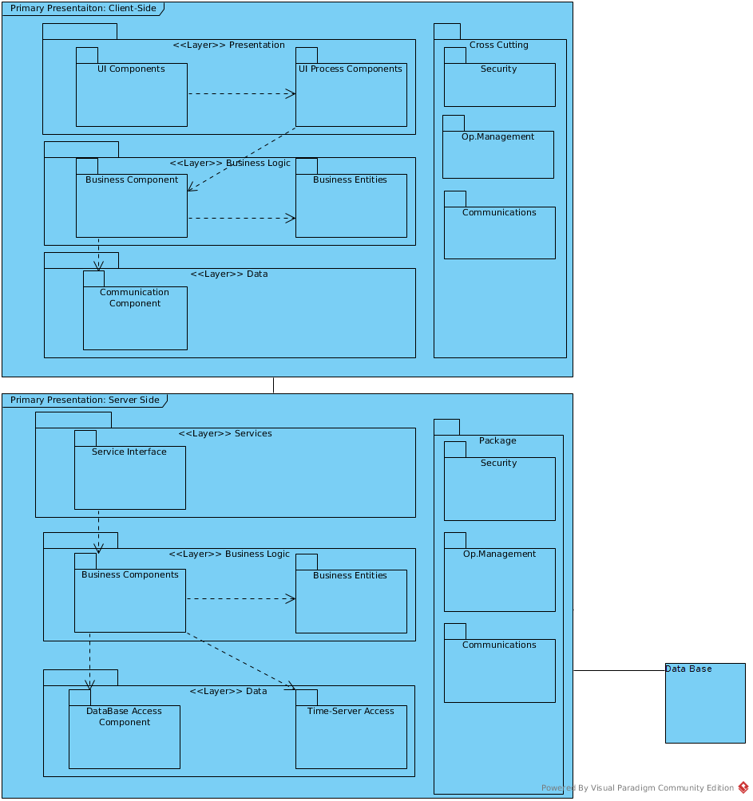
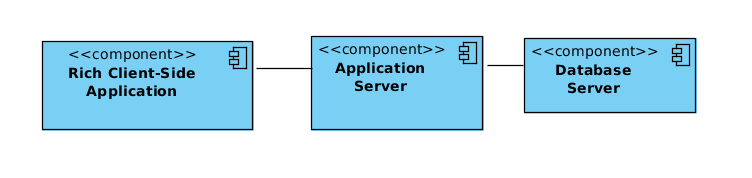
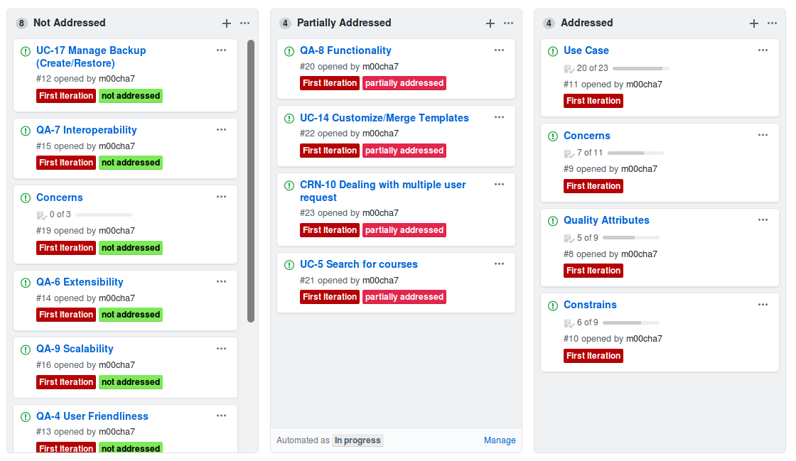

### 1st Iteration
----

#### Step1: Review Inputs
The first step of the ADD method involves reviewing the inputs and identifying which requirements will be considered as drivers. The inputs are summarized in the following table.

#### Step2: Establish iteration goal by selecting drivers
This is the first iteration in the design of a greenfield system, so the iteration goal is to establish an overall system structure.

Goal: |Establishing an overall system structure |
--|--

Drivers| Inputs |
--|--
QA-1 | Performance |
QA-3 | Availability |
QA-4 | User friendliness |
QA-5 | Security  |
QA-8 | Functionality  |
QA-12| Privacy |
All CON, CNR |

#### Step3: Choose one of more elements of the system to decompose
* Since this is a greenfield system, the only element to decompose is the entire CMS sytem.

#### Step4: Choose one or more design concepts that satisfy the selected driver
##### Architectural / Design Patterns
* Object-oriented
* **Client-server** : Layered Style
* Blackboard
* Event Based
* **Publish-subscribe**

##### Reference Architecture Alternatives
* Mobile Applications
* Rich Client Application
* **Rich Internet Applications**
* Web Application
* **Service Application**
##### Distributed deployment patterns alternatives
* 2 tier
* **3 tier**
* 4 tier

Choice
----
### Layered Architecture
 |
### Rich Internet Application
 |
### Services Layer
 |
### Distributed Deployment Pattern
 |

Design Decision| Rational|
-|-
Service Application|<li> The services layer effectively provides an alternative view that allows clients to use a different channel to access the application  [UC-20,21,23] <li> users can access the application through the presentation layer, which communicates directly with the components in the business layer. Meanwhile, external clients and other systems can access the application and make use of its functionality by communicating with the business layer through service interfaces.[QA-8] [UC-4,13,14,10,11,15,16] [CON-6] This allows the application to better support multiple client types, and promotes re-use and higher level composition of functionality across applications. **[CON-7,8,9] [QA-3,4,7]** [UC-4,19,23,12,9]  [CRN-7,10]
Rich Internet Application|<li> The CMS needs to be accessible from a web browser to allow for high availabilty and accessibility [QA-3,15]. This reference architecture provides the development of applications with a rich user interface that runs inside the web browser. It is highly graphical and supports rich media and presentation features which will allow dynamic and static search for courses as well as getting in user inputs [UC-1,2,3,5,8]**[CON-5]**  <li> RIA would also provide highly modifiable and flexible interface on the client side to take care of accessiblity needs and notification view modification. [QA-10,2,15] [UC-14] <li> RIA would also allow for state and exception management within client interface resulting [CRN-1,4]
Pub-Sub Pattern|<li> In congruence with course messaging system **[CON-7]** [UC-6,11,22]
3-Tire|<li> Implementations move presentation logic to the client. resulting in performance optimization **[CON-4]** <li> Some type of replication is needed on both web/app tier and the database tier to support [QA-3]. <li> Web/App tier would also perform authentication and password reset functionality. [UC-7]. [QA-5,12,13] [CRN-6]
Layered Architecture|<li> Layers help to differentiate between the different kinds of tasks performed by the components, making it easier to create a design that supports *reusability* of components **[ ]** <li> Dividing an application into separate layers that have distinct roles and functionalities helps you to maximize *maintainability* of the code, optimize[CON-5] the way that the application works when deployed. This will also allow authentication [CON-3] [CRN-2,3] and retrival of data based on user priviliges **[QA-1,11,13]** ** ** ** [UC-7,9].

#### Step5: Instantiate architectural elements, allocate responsibilities and define interfaces
* Interfaces are not defined in the first iteration

##### Client Side
Element| Responsibility | Properties
-|-|-
User Work Station|Incorporates client side components and connects with the application server|OS = Windows, Linux, Mac, Runs on JavaScript|
Presentation Layer| defines the logical behavior and structure of the application in a way that is independent of any specific user interface implementation.| Flash Player |
Business Layer| This layer implements core functionality of the system, and encapsulates the relevant business logic.||
Data Layer:|The data layer exposes generic interfaces that the components in the business layer can consume|json|
UI Components| These are the application's visual elements used to display information to the user and accept user input.||
UI Processor Components| This component process the user input and prepares it to be sent to business layer in a manner that is representative.||
Business Components| After the UI processor collect the required data from the user and pass it to the business layer, the application can use this data to perform a business process. ||
Business Entities| Business entities encapsulate the business logic and data necessary to represent real world elements|business objects|
Communication Components|Responsible for interaction with the application server|internet connection|

##### Server Side

Element| Responsibility
-|-
Application Server| Hosts the element of the service reference architecture. Connects to clients and database server||
Service Layer|Composed of multiple services, each communicating with the others by passing messages. It provides alternative view that allows clients to use a different channel to access the application.||
Business Layer|Contains components which expose service interfaces that other callers can use.||
Data Layer| This layer provides access to data hosted within the boundaries of the system.| |
Service Interfaces| external clients and other systems can access the application and make use of its functionality by communicating with the business layer through service interfaces||
Business Component|<li>Business concerned with the retrieval, processing, transformation, and management of application data.<li>Application of business rules and policies; and ensuring data consistency and validity||
Business Entities Component |Business entities validate the data contained within the entity and encapsulate business logic to ensure consistency and to implement business rules and behavior||
DB Access Component| Database engine(DBMS) that allows Retrieval, modification and maintenance of data. ||
DATA|responsible for Physical storage of the data at very low level||

#### Step6: Sketch views and record design decisions

#### Step7: Perform analysis of current design and review iteration goal and design objectives

