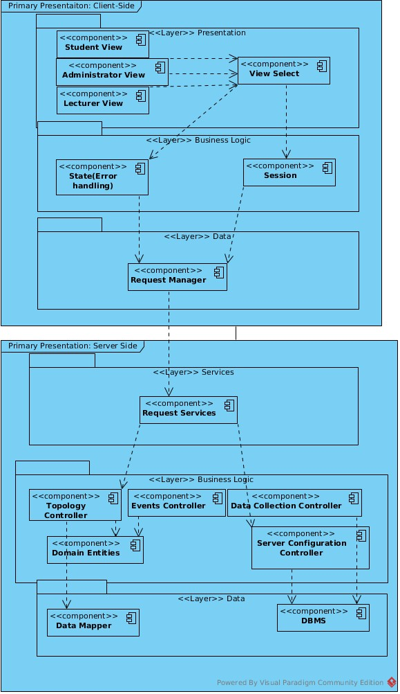
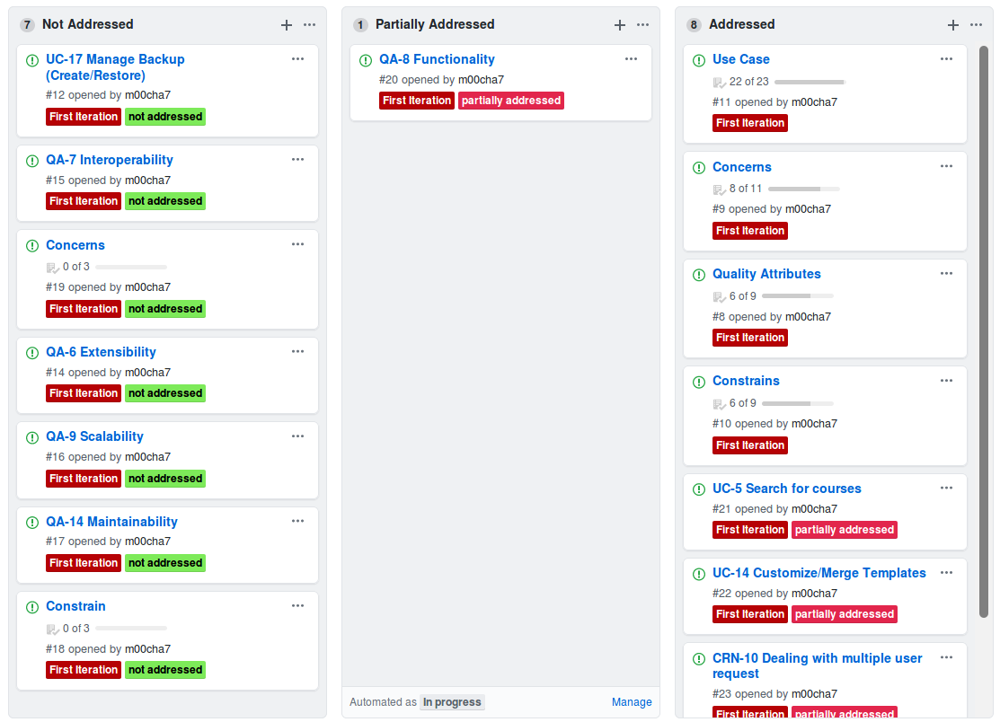

# Iteration 2

#### Step2: Establish iteration goal by selecting drivers
Goal|Defining the components of the architecture to achieve the functional requirements of the system|
--|--

Drivers
---
Use Cases,
Quality Attributes,
Constrains,
Concerns,

Note: Since use cases and quality attributes address primary functionality of our systems. Drivers are partially addressed and not addressed instances of uses cases and quality attributes from pervious iteration

#### Step3: Choose one of more elements of the system to decompose
Since functionality is typically supported by elements that are spread across the layers of the system, the elements are the different layers that were identified in the previous iteration

#### Step4: Choose one or more design concepts that satisfy the selected driver
Design Decision| Rational
-|-
Use domain objects (e.g. components) to decompose layers Decomposition of the layers| facilitates work assignment and associating technologies to components
Use REACT Framework for client Side| Developers are familiar with this framework. Allows users to search courses statically and dynamically.**[UC-5]** Allows users to customize/merge templates **[UC-14]**. Allows to create simple UI components essential for user friendliness **[QA-4]**

#### Step5: Instantiate architectural elements, allocate responsibilities and define interfaces
Design Decision| Rational
-|-
Decompose the domain objects across the layers to identify layer-specific modules with an explicit interface | This allows to make us modules that are independent in there functionalities. Since the actors on the scene have different roles and may require different privileges we can implement independent functionalities as per user request.  **[CRN-10]**
Connect UI-components associated with modules using REACT library Material-UI| This library allows us to build user friendly components that are easy to implement as individual views **[QA-4]**

Element| Responsibility|
-|-
Student View|Holds UI Components for student view|
Admin View|Holds UI Components for Admin View|
Lecturer View|Holds UI Components for Lecturer views|
View Select|Responsible for selecting relevant view for the user.|
State|Responsible for error handling|
Session|Responsible for logging and maintaining user into a session. can also save user information in cookies|
Request Manager|Responsible for communication with the server-side logic|
Request Services|Provides a facade that receives request from the clients.|
Topology Controller|Contains business logic related to the topological information
Events Controller|Contains business logic related to the management of events|
Data Collection Controller|Contains logic to perform data collection and storage.|
Domain Entities|Contains the entities from the domain mode(server side)|
Server Configuration Controller|Holds the information to connect to DBMS
Data Mapper|Responsible for persistence operations(CRUD) related to the user
DBMS| Connects to the database
Push Connector| Responsible messaging and notification

#### Step6: Sketch views and record design decisions

#### Step7: Perform analysis of current design and review iteration goal and design objectives

