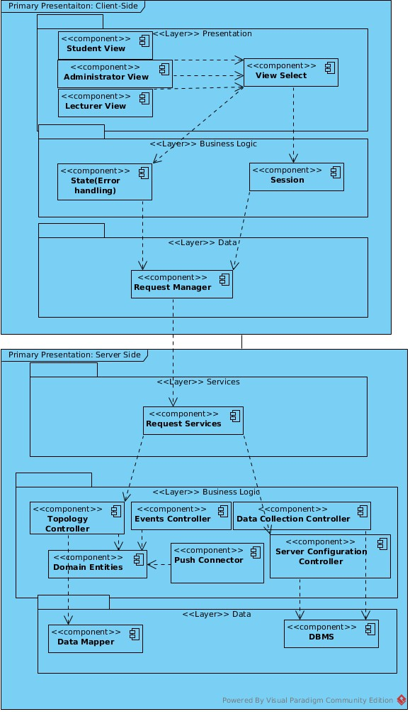
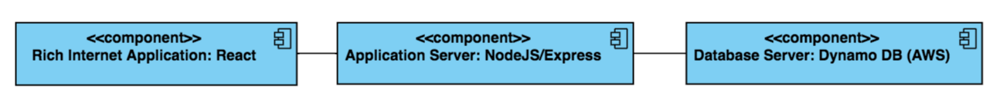
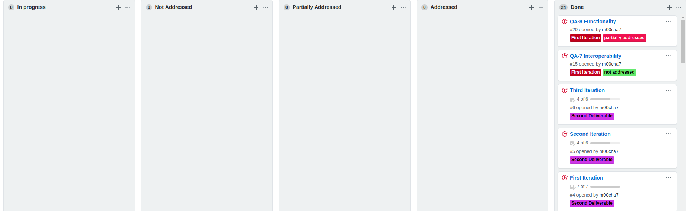

# Iteration 3

#### Step2: Establish iteration goal by selecting drivers
Goal|Refactoring the architecture to achieve the quality requirements of the system|
--|--

### Address Quality Attributes, Use Case, Concerns and Constrains not satisfied in previous iteration
---
A failure occurs in the course management system during operation. The system deals with the crash within 4 hours.
 
Messaging System

#### Step3: Choose one of more elements of the system to decompose
* Application Server
* Database Server
#### Step4: Choose one or more design concepts that satisfy the selected driver
Design Decision| Rational|
-|-
Introduce active redundancy by replicating the application server and other critical components such as the databases|By replicating the critical components, the system can withstand the failure of one of the replicated elements without affecting functionality.
Allow DBMS to perform regular maintained to minimize downtime| Using a database that has this functionality can drastically improve application performance|
Introduce push notification using cloud based server| Allows for multiple user message handling|
USE AWS Server|Easy to administer **[QA-14]**, Highly Scalable **[QA-9][CRN-9][CON-2][CON-4]**, Available and Durable **[CRN-8],[CON-1]**, Fast, Secure **[CRN-11]** Allows you to schedule automatic backup **[UC-17]**
USE Google Cloud Messaging to engage user|Allows application developers to send notification data or information from Client-Side servers|

#### Step5: Instantiate architectural elements, allocate responsibilities and define interfaces
Element|Responsibility |
-|-
Push Connector|Distribute messages to your client app in any of three ways to single devices, to groups of devices, or to devices subscribed to topics.|

Element|Responsibility|
-|-
Node/Express Sever|Allows for communication with cloud server for messaging and push notification as well as data transfer to client side|
AWS Database Server| Allows for database maintenance and communication with the low level data|

#### Step6: Sketch views and record design decisions

#### Step7: Perform analysis of current design and review iteration goal and design objectives

