# 1st Deliverable

- [x] Design objective
- [x] Capture Use Cases
- [x] Quality Attributes 
- [x] Scenarios 
- [x] Constrain Requirements 
- [x] Concerns

# 2nd Deliverable-Design Process
----
## 3 Step Iterative Process 

### 1st Iteration
---- 

#### Step1: Review Inputs 

#### Step2: Establish iteration goal by selecting drivers

Goal|Defining the structure of the System |
--|--

Drivers| All Inputs|
-|-

#### Step3: Choose one of more elements of the system to decompose
* Since this is a greenfield system, the only element to decompose is the system itself

#### Step4: Choose one or more ==design concepts== that satisfy the selected driver
##### Architectural / Design Patterns
* Object-oriented
* **Client-server** : Layered Style 
* Blackboard
* Event Based
* **Publish-subscribe**

##### Reference Architecture Alternatives
* Mobile Applications
* **Rich Client Application**
* Rich Internet Applications
* Web Application 
* **Service Application**
##### Distributed deployment patterns alternatives
* 2 tier
* **3 tier**
* 4 tier

Choice|
----
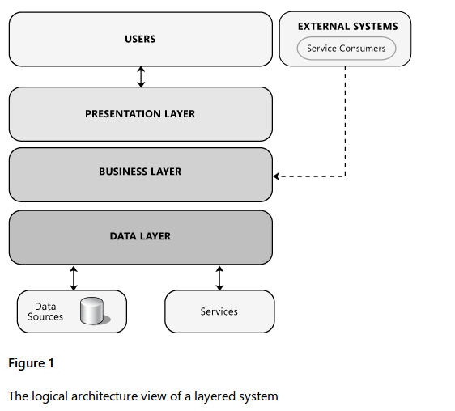|
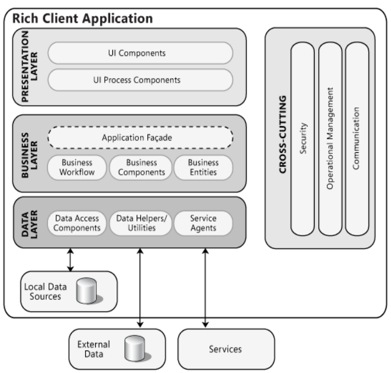|
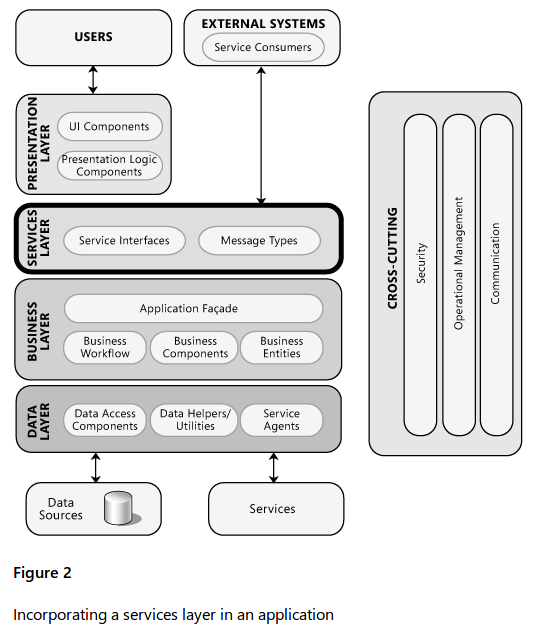|
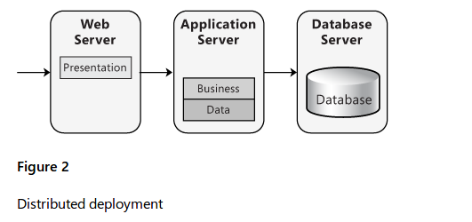|

Design Decision| Rational|
-|-
Service Application|<li> The services layer effectively provides an alternative view that allows clients to use a different channel to access the application  [UC-20,21,23] <li> users can access the application through the presentation layer, which communicates directly with the components in the business layer. Meanwhile, external clients and other systems can access the application and make use of its functionality by communicating with the business layer through service interfaces.[QA-8] [UC-4,13,14,10,11,15,16] [CON-6] This allows the application to better support multiple client types, and promotes re-use and higher level composition of functionality across applications. **[CON-7,8,9] [QA-3,4,7]** [UC-4,19,23,12,9]  [CRN-7,10]
Rich Client Application|<li> connected applications that have broad cross-platform reach, are highly graphical, and support rich media and presentation features this will allow dynamic and static search for courses as well as getting in user inputs [UC-1,2,3,5,8] **[CON-5]**  <li> RCA would also provide highly modifiable and flexible interface on the client side to take care of accessiblity needs and notification view modification. [QA-10,2,15] [UC-14] <li> RCI would also allow for state and exception management within client interface resulting [CRN-1,4] 
Pub-Sub Pattern|<li> In congruence with course messaging system **[CON-7]** [UC-6,11,22] 
3-Tire|<li> Implementations move presentation logic to the client. resulting in performance optimization **[CON-4]** <li> Some type of replication is needed on both web/app tier and the database tier to support [QA-3]. <li> Web/App tier would also perform authentication and password reset functionality. [UC-7]. [QA-5,12,13] [CRN-6]
Layered Architecture|<li> Layers help to differentiate between the different kinds of tasks performed by the components, making it easier to create a design that supports *reusability* of components **[ ]** <li> Dividing an application into separate layers that have distinct roles and functionalities helps you to maximize *maintainability* of the code, optimize[CON-5] the way that the application works when deployed. This will also allow authentication [CON-3] [CRN-2,3] and retrival of data based on user priviliges **[QA-1,11,13]** ** ** ** [UC-7,9].

#### Step5: Instantiate architectural elements, allocate responsibilities and define interfaces
* Interfaces are not defined in the first iteration
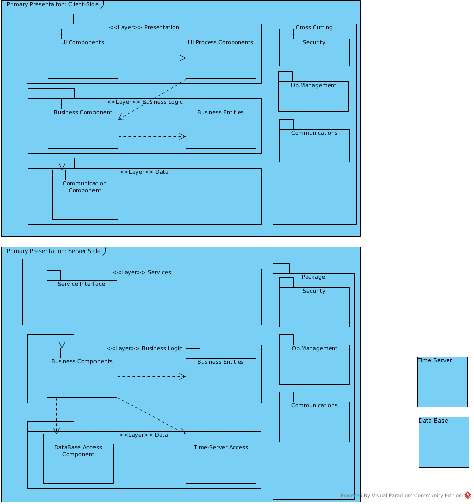
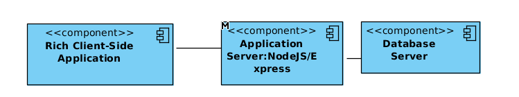
##### Client Side
Element| Responsibility | Properties
-|-|-
User Work Station|Incorporates client side components and connects with the application server|OS = Windows, Linux, Mac, Runs on JavaScript|
Presentation Layer| defines the logical behavior and structure of the application in a way that is independent of any specific user interface implementation.| Flash Player |
Business Layer| This layer implements core functionality of the system, and encapsulates the relevant business logic.||
Data Layer:|The data layer exposes generic interfaces that the components in the business layer can consume|json|
UI Components| These are the application's visual elements used to display information to the user and accept user input.||
UI Processor Components| This component process the user input and prepares it to be sent to business layer in a manner that is representative.|| 
Business Components| After the UI processor collect the required data from the user and pass it to the business layer, the application can use this data to perform a business process. ||
Business Entities| Business entities encapsulate the business logic and data necessary to represent real world elements|business objects|
Communication Components|Responsible for interaction with the application server|internet connection|

##### Server Side

Element| Responsibility 
-|-
Application Server| Hosts the element of the service reference architecture. Connects to clients and database server||
Service Layer|Composed of multiple services, each communicating with the others by passing messages. It provides alternative view that allows clients to use a different channel to access the application.||
Business Layer|Contains components which expose service interfaces that other callers can use.||
Data Layer| This layer provides access to data hosted within the boundaries of the system.| |
Service Interfaces| external clients and other systems can access the application and make use of its functionality by communicating with the business layer through service interfaces||
Business Component|<li>Business concerned with the retrieval, processing, transformation, and management of application data.<li>Application of business rules and policies; and ensuring data consistency and validity||
Business Entities Component |Business entities validate the data contained within the entity and encapsulate business logic to ensure consistency and to implement business rules and behavior||
DB Access Component| Database engine(DBMS) that allows Retrieval, modification and maintenance of data. ||
DATA|responsible for Physical storage of the data at very low level||

#### Step6: Sketch views and record design decisions

#### Step7: Perform analysis of current design and review iteration goal and design objectives 

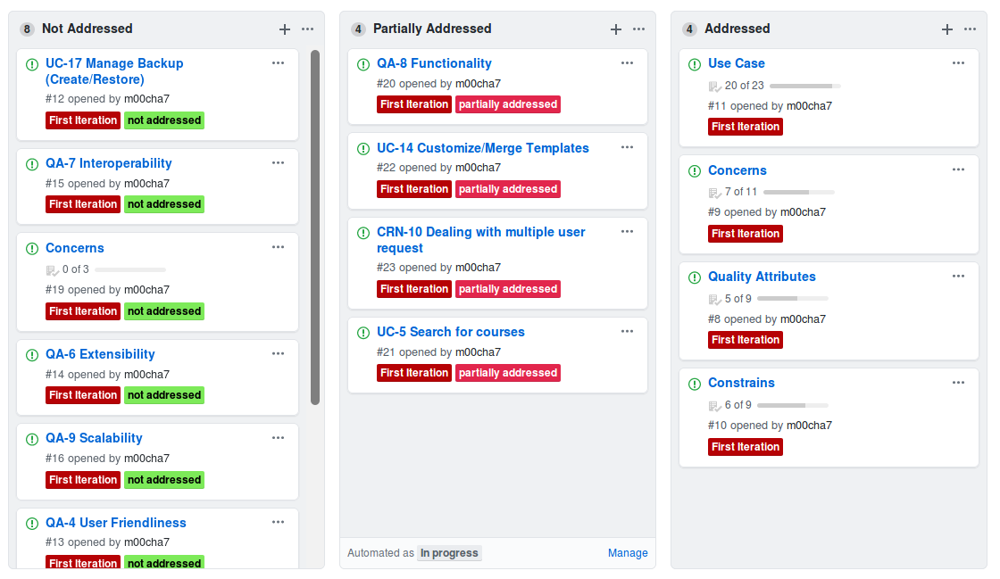

### 2nd Iteration
----

#### Step2: Establish iteration goal by selecting drivers
Goal|Defining the components of the architecture to achieve the functional requirements of the system|
--|--

Drivers|
---
Use Cases|
Quality Attributes|
Constrains|
Concerns|

Note: Since use cases and quality attributes address primary functionality of our systems. Drivers are partially addressed and not addressed instances of uses cases and quality attributes from pervious iteration

#### Step3: Choose one of more elements of the system to decompose
Since functionality is typically supported by elements that are spread across the layers of the system, the elements are the different layers that were identified in the previous iteration

#### Step4: Choose one or more design concepts that satisfy the selected driver
Design Decision| Rational 
-|-
Use domain objects (e.g. components) to decompose layers Decomposition of the layers| facilitates work assignment and associating technologies to components
Use REACT Framework for client Side| Developers are familiar with this framework. Allows users to search courses statically and dynamically.**[UC-5]** Allows users to customize/merge templates **[UC-14]**. Allows to create simple UI components essential for user friendliness **[QA-4]**  

#### Step5: Instantiate architectural elements, allocate responsibilities and define interfaces
Design Decision| Rational
-|-
Decompose the domain objects across the layers to identify layer-specific modules with an explicit interface | This allows to make us modules that are independent in there functionalities. Since the actors on the scene have different roles and may require different privileges we can implement independent functionalities as per user request.  **[CRN-10]**
Connect UI-components associated with modules using REACT library Material-UI| This library allows us to build user friendly components that are easy to implement as individual views **[QA-4]**

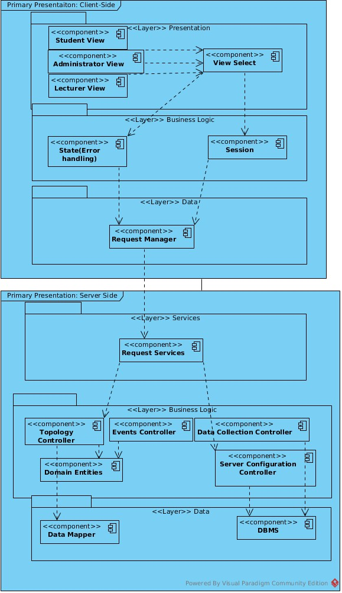

Element| Responsibility| 
-|-
Student View|Holds UI Components for student view|
Admin View|Holds UI Components for Admin View|
Lecturer View|Holds UI Components for Lecturer views|
View Select|Responsible for selecting relevant view for the user.| 
State|Responsible for error handling|
Session|Responsible for logging and maintaining user into a session. can also save user information in cookies|
Request Manager|Responsible for communication with the server-side logic|
Request Services|Provides a facade that receives request from the clients.|
Topology Controller|Contains business logic related to the topological information
Events Controller|Contains business logic related to the management of events|
Data Collection Controller|Contains logic to perform data collection and storage.|
Domain Entities|Contains the entities from the domain mode(server side)|
Server Configuration Controller|Holds the information to connect to DBMS
Data Mapper|Responsible for persistence operations(CRUD) related to the user
DBMS| Connects to the database 
Push Connector| Responsible messaging and notification 

#==Interface==

#### Step6: Sketch views and record design decisions

#### Step7: Perform analysis of current design and review iteration goal and design objectives 
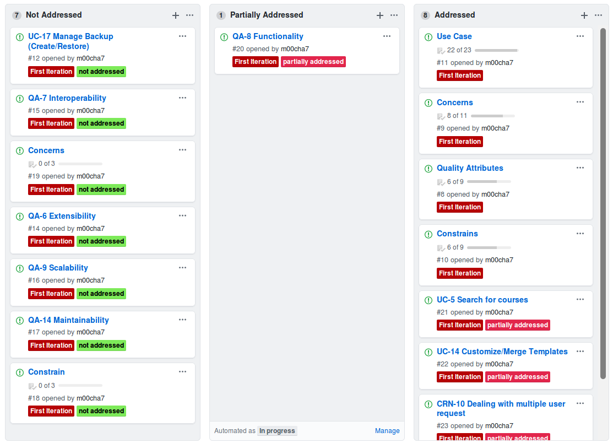

### 3rd Iteration
---- 

#### Step2: Establish iteration goal by selecting drivers
Goal|Refactoring the architecture to achieve the quality requirements of the system|
--|--

Address Quality Attributes, Use Case, Concerns and Constrains not satisfied in previous iteration|
---
A failure occurs in the course management system during operation. The system deals with the crash within 4 hours.|
Messaging System|

#### Step3: Choose one of more elements of the system to decompose
* Application Server
* Database Server
#### Step4: Choose one or more design concepts that satisfy the selected driver
Design Decision| Rational|
-|-
Introduce active redundancy by replicating the application server and other critical components such as the databases|By replicating the critical components, the system can withstand the failure of one of the replicated elements without affecting functionality.
Allow DBMS to perform regular maintained to minimize downtime| Using a database that has this functionality can drastically improve application performance|
Introduce push notification using cloud based server| Allows for multiple user message handling| 
USE AWS Server|Easy to administer **[QA-14]**, Highly Scalable **[QA-9][CRN-9][CON-2][CON-4]**, Available and Durable **[CRN-8],[CON-1]**, Fast, Secure **[CRN-11]** Allows you to schedule automatic backup **[UC-17]**
USE Google Cloud Messaging to engage user|Allows application developers to send notification data or information from Client-Side servers| 

#### Step5: Instantiate architectural elements, allocate responsibilities and define interfaces
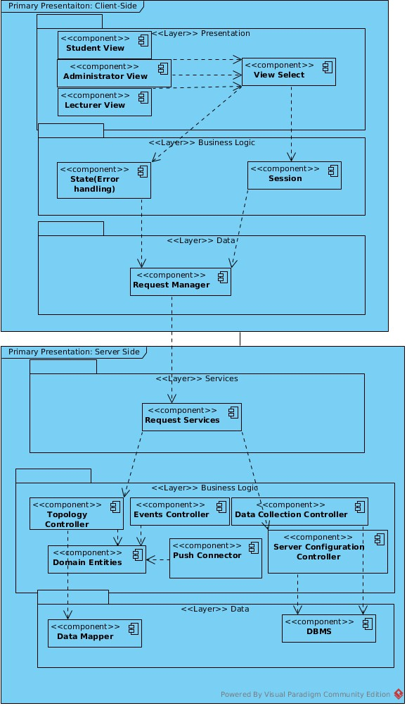
Element|Responsibility|
-|-
Push Connector|Distribute messages to your client app in any of three ways — to single devices, to groups of devices, or to devices subscribed to topics.

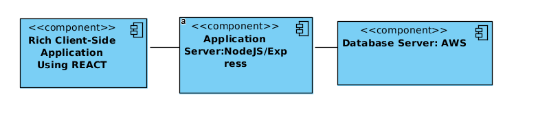

Element|Responsibility|
-|-
Node/Express Sever|Allows for communication with cloud server for messaging and push notification as well as data transfer to client side| 
AWS Database Server| Allows for database maintenance and communication with the low level data| 

#### Step6: Sketch views and record design decisions

#### Step7: Perform analysis of current design and review iteration goal and design objectives 
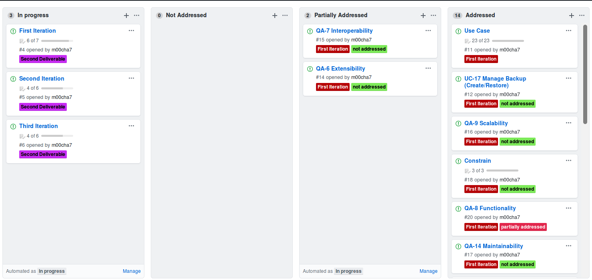

